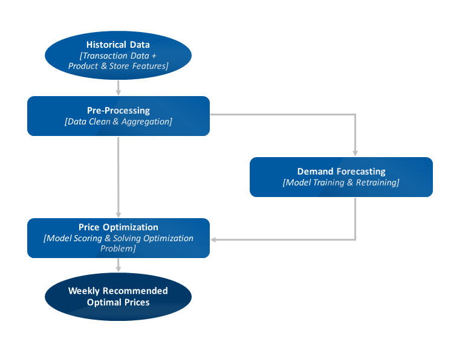

# Case Studies

## Analytics

### Case procedures

#### Pricing

1. Data collection: transactional data, product data, customer data
2. Exploratory data analysis: understand the data, identify patterns, and relationships
3. Preprocessing: data cleaning, feature engineering
4. Forecasting: predict demand
5. Optimization: price optimization
   - Given the demand forecast, the goal is to find the optimal price that maximizes the profit
6. Recommendation: recommend prices to the business
7. Evaluation: A/B testing / Causal Impact Analysis

Examples: [online retail analytics notes](/online_retail_analytics.md)

#### Searching

The usual procedure of Bayesian search theory is as follows: [ref](https://en.wikipedia.org/wiki/Bayesian_search_theory)

1. Formulate as many reasonable hypotheses as possible about what may have happened to the object.
2. For each hypothesis, construct a probability density function for the location of the object.
3. Construct a function giving the probability of actually finding an object in location X when searching there if it really is in location X. In an ocean search, this is usually a function of water depth — in shallow water chances of finding an object are good if the search is in the right place. In deep water chances are reduced.
4. Combine the above information coherently to produce an overall probability density map. (Usually this simply means multiplying the two functions together.) This gives the probability of finding the object by looking in location X, for all possible locations X. (This can be visualized as a contour map of probability.)
5. Construct a search path which starts at the point of highest probability and 'scans' over high probability areas, then intermediate probabilities, and finally low probability areas.
6. Revise all the probabilities continuously during the search. For example, if the hypotheses for location X imply the likely disintegration of the object and the search at location X has yielded no fragments, then the probability that the object is somewhere around there is greatly reduced (though not usually to zero) while the probabilities of its being at other locations is correspondingly increased. The revision process is done by applying Bayes' theorem.

### Real case studies

- [How Writing My Thesis on League of Legends Made Me Stop Playing](https://www.youtube.com/watch?v=a-a6__xFeVc)
- [Beta 存活模型](https://taweihuang.hpd.io/2020/02/23/beta-survival-model/)
- [利用斷點迴歸設計設計估計需求曲線 – Uber 案例](https://taweihuang.hpd.io/2018/09/09/nat_exp_rdd_uber/)

## Tech blogs

- [Netflix Tech Blog](https://netflixtechblog.com/)
- [Discord Engineering & Developers](https://discord.com/category/engineering)
- [Line Engineering](https://engineering.linecorp.com/zh-hant/blog)
- [Uber Engineering Blog](https://www.uber.com/en-HK/blog/engineering/)
- [Jane Street Tech Blog](https://blog.janestreet.com/)
- [Airbnb Engineering & Data Science](https://medium.com/airbnb-engineering)
- [Facebook Engineering Blog](https://engineering.fb.com/)
- [Google AI Blog](https://ai.googleblog.com/)
- [Microsoft Research Blog](https://www.microsoft.com/en-us/research/blog/)
- [Apple Machine Learning Journal](https://machinelearning.apple.com/)
- [Amazon Science](https://www.amazon.science/)
- [Agoda Tech Blog](https://medium.com/agoda-engineering)
- [Twitter Engineering Blog](https://blog.twitter.com/engineering)
- [LinkedIn Engineering Blog](https://engineering.linkedin.com/blog)
- [Pinterest Engineering Blog](https://medium.com/pinterest-engineering)
- [Slack Engineering Blog](https://slack.engineering/)
