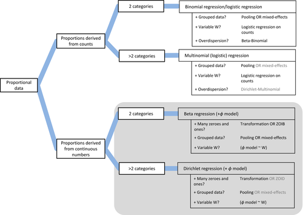
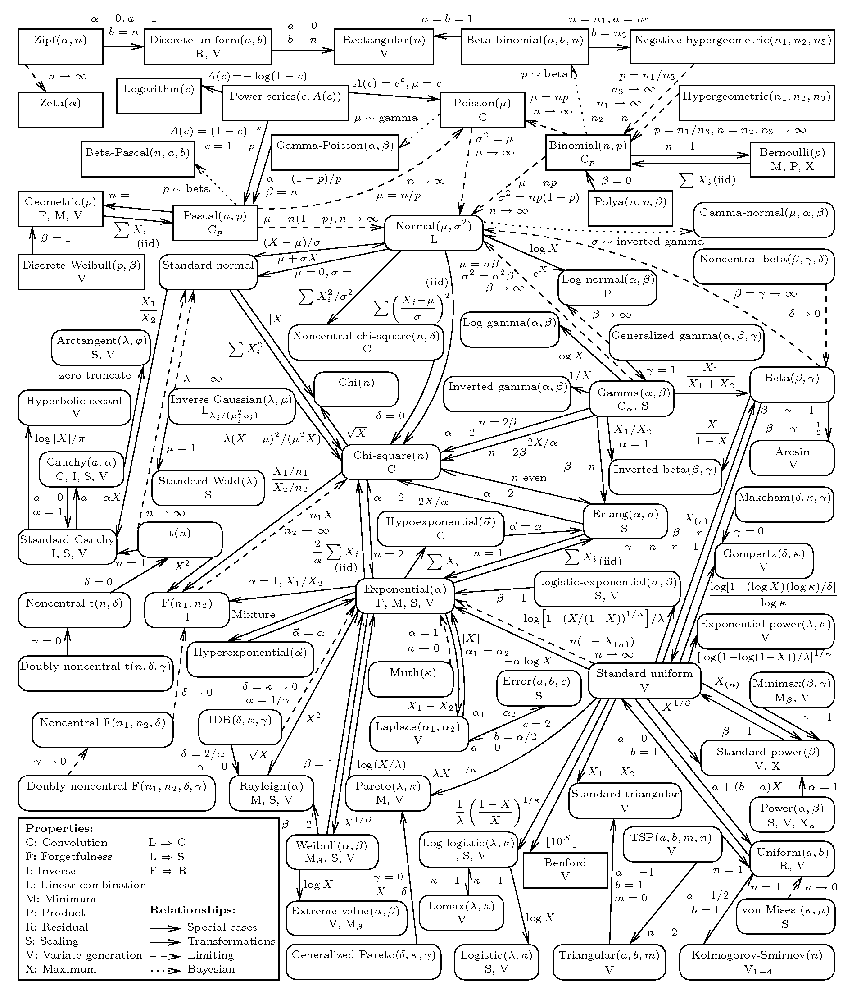

# Distributions

Note that we are actually modeling the conditional distribution of the response variable (so Y|X, not the marginal Y). Observing skewness on the marginal target distribution does not necessarily mean that the conditional distribution is skewed, nor should we apply log transformation to the target variable to make it normal. For example, a Y|X follows normal distribution while X follows Poisson distribution would lead to a right skew marginal distribution of Y. However, we would never observe the full picture of the conditional distribution. So the choice of the distribution to model, or to form a loss function, often comes from our imaginations, business thoughts, statistical intuitions, and mathematical tractability. [ref](https://stats.stackexchange.com/a/492738)

## Popular choice of modeling

- The heights of a population are normally distributed.
- The sampling distribution of the sample mean is normally distributed if the sample size is large enough, even if the population is not normally distributed (CLT).
- The outcome of a coin flip is Bernoulli distributed.
- The number of heads in n coin flips is binomial distributed.
- The number of successes in n events without replacement is hypergeometric distributed.
- The number of events in a fixed interval of time is Poisson distributed. It assumes the conditional variance is the same as the conditional mean.
- The time between events in a Poisson process is exponentially distributed.
- The number of failures before the r-th success in a sequence of Bernoulli trials is negative binomial distributed. It allows overdispersion, that is, the conditional variance is greater than the conditional mean, even it is substantially higher.
- The number of trials until the first success in a sequence of Bernoulli trials is geometric distributed.
- [Beta geometric distribution] is a compound distribution that is generalization of the geometric distribution. The beta geometric distribution extends geometric distribution by allowing flexibility in how probabilities change from one trial to another. Which is good for churn prediction.
- Gamma distribution is the continuous analog of the negative binomial distribution. [ref](https://besjournals.onlinelibrary.wiley.com/doi/pdf/10.1111/2041-210X.12843).[ref2](https://biol609.github.io/lectures/13_zinfl.html#53_The_error_generating_process) [when to use gamma glms](https://stats.stackexchange.com/questions/67547/when-to-use-gamma-glms)
- Log gamma distribution is left skewed, i.e. longer tail at the left. It is great to model such kind of data. [discussion on gamma vs lognormal](https://stats.stackexchange.com/questions/72381/gamma-vs-lognormal-distributions)
- Any continuous proportion data without 0s and 1s can be modeled with beta distribution. It can be augmented by zero-inflated / one-inflated model to include 0s and 1s. [example](https://www.andrewheiss.com/blog/2021/11/08/beta-regression-guide/) [ref](https://besjournals.onlinelibrary.wiley.com/doi/10.1111/2041-210X.13234) 
- Dirichlet distribution is a multivariate generalization of the beta distribution. It is used to model the distribution of proportions. It is different from using multiple beta distributions in that it consider covariances between the beta variables, i.e. those random variables are no longer independent. It is the conjugate prior of categorical distribution and multinomial distribution, which are the generalization of Bernoulli distribution and binomial distribution respectively. [blog](https://cosx.org/2013/01/lda-math-beta-dirichlet/) [usage](https://www.andrewheiss.com/blog/2023/09/18/understanding-dirichlet-beta-intuition/) [distribution explorer](https://distribution-explorer.github.io/multivariate_continuous/dirichlet.html)
- Asymmetric Laplace distribution is great for quantile regression. It can be parametrized by quantile $q$ as symmetry parameter, mean $\mu$ as location parameter, and standard deviation $\sigma$ as scale parameter $b$. Although drawing quantiles of posterior mean is okay, the shape of curves is essentially the same just shifted up and down, i.e. for the Gaussian family the variability always stays the same. However, using asymmetric Laplace distribution, it allows the model to account for the increased variability in response as the covariates increases. [example](https://www.pymc.io/projects/bart/en/latest/examples/bart_quantile_regression.html#asymmetric-laplace-distribution) [paper](https://doi.org/10.1093/biostatistics/kxj039)
- Zero-sum-normal distribution is a multivariate normal distribution with zero mean and $\sigma^2 (I-n^{-1}J)$ covariance matrix, where $J_{ij}=1$. It is useful to capture the relative difference across some axes, e.g. for modeling seasonality. [doc](https://www.pymc.io/projects/docs/en/latest/api/distributions/generated/pymc.ZeroSumNormal.html)
- Tweedie distribution is good to model zero-inflated data, e.g. [insurance total loss](https://stats.stackexchange.com/questions/492726/what-is-use-of-tweedie-or-poisson-loss-objective-function-in-xgboost-and-deep-le) It assume that the probability of an exact zero is related to the expected value of the process. If the expected value is low, then zeros will be more common. If the expected value is high, then zeros will be less common. This relationship can be tuned somewhat by choosing the index of the Tweedie model but, if the relationship doesn't hold as expected, then a more complex ZI model may be required. [ref](https://stats.stackexchange.com/a/582138)
  - Note that Tweedie regression is actually Poisson-Gamma regression, where the Poisson distribution is used to model the frequency and the Gamma distribution is used to model the severity, i.e. the monetary value per claim. [ref](https://stats.stackexchange.com/questions/492726/what-is-use-of-tweedie-or-poisson-loss-objective-function-in-xgboost-and-deep-le)

Check out the [Distribution Explorer#Story](https://distribution-explorer.github.io/discrete/poisson.html) of each distribution for more information.

## Distribution transformation

- Sum of two independent normal random variables is a normal random variable.
  - There are other distributions that have this property, such as the binomial, Cauchy, Poisson, gamma, beta, and Student's t distributions.
- Sum of n independent exponential random variables is a gamma random variable with shape parameter n.
- The Gamma distribution is the continuous analog of the Negative Binomial distribution.
- Bernoulli distribution is a special case of the binomial distribution with n=1.
- Sum of n Bernoulli random variables is a binomial random variable.
- Beta distribution is a special case of the Dirichlet distribution.
- Cauchy distribution distribution is a special case of the Student-t distribution in which $v=1$.
- Normal distribution is a special case of the Student's t distribution.
- A standard normal deviate is a random sample from the standard normal distribution. The Chi Square distribution is the distribution of the sum of squared standard normal deviates. The degrees of freedom of the distribution is equal to the number of standard normal deviates being summed.

Check out the [Distribution Explorer#Related distributions](https://distribution-explorer.github.io/multivariate_continuous/dirichlet.html) of each distribution for more information.

## Loss distributions

It can be applied to build a loss function that fits the business problem. Note that whenever developing custom loss distributions that are not implemented by the libraries, [deviance](https://bookdown.org/egarpor/PM-UC3M/glm-deviance.html) objective function, gradients, and Hessians should be implemented and provided to the library. How it is done is directly related to deriving [loss function in GLM](generalized-linear-models.md#loss-functions). Following are some industries that use specific distributions as a loss function:

- [Doordash - Using Gamma Distribution to Improve Long-Tail Event Predictions](https://careersatdoordash.com/blog/using-gamma-distribution-to-improve-long-tail-event-predictions/)
  - [Improving ETA Prediction Accuracy for Long-tail Events](https://careersatdoordash.com/blog/improving-eta-prediction-accuracy-for-long-tail-events/)
  - Note that the team modeled the entire delivery time instead of breaking it up into sub-components because delivery estimates are complex to predict considering variance in preparation time, dasher assignment, traffic, and difficulty in finding customer's doors. If most of the sub-components could not be modeled correctly, the errors induced would be accumulated to yield much poor overall estimates
- [Tweedie distribution](https://www.kaggle.com/competitions/m5-forecasting-accuracy/discussion/150614) as a loss function to estimate forecasts of the unit sales of various products sold in the USA by Walmart.

And the following are the resources detailing the theory behind:

- [StackExhange | Loss functions for specific probability distribtuions?](https://or.stackexchange.com/questions/102/loss-functions-for-specific-probability-distributions)
- [Loss Distributions](https://mpra.ub.uni-muenchen.de/22163/2/MPRA_paper_22163.pdf)
- [Piecewise linear approximations of the standard normal first order loss function](https://arxiv.org/pdf/1307.1708)
- [Piecewise linearisation of the first order loss function for families of arbitrarily distributed random variables](https://gwr3n.github.io/chapters/Rossi_et_al_MAGO_2014_2.pdf)

## Acknowledgements

- [Univariate Distribution Relationships Graph](https://www.math.wm.edu/~leemis/chart/UDR/UDR.html)
- [Distribution Explorer](https://distribution-explorer.github.io/index.html)
- [Statistics in Marketing - Continuous Probability Distributions](https://bernard-mlab.com/post/probability-distribution2/)
- [How to Learn Probability Distributions](https://www.youtube.com/watch?v=mBCiKUzwdMs)

## Best Graph for Distributions

