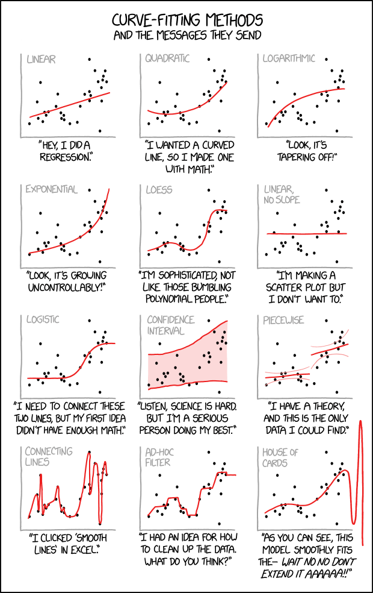

# Modeling

## One-liners

- "All models are wrong, but some are useful." -- George Box
- "A model is a simplification or approximation of reality and hence will not reflect all of reality … While a model can never be "truth," a model might be ranked from very useful, to useful, to somewhat useful to, finally, essentially useless." -— Ken Burnham and David Anderson
- The best model is the simplest model that explains the data -- Occam's razor
- Avoid Simpson's paradox
- It is a must to be aware of [overfitting](regularization.md)

## Background

- dataset $d$, where $d = {(x_i, y_i)), i=1,2,...,N}$
- $x_i$ is a vector of predictors, or "covariates" taking its value in some space $\mathcal{X}$
- response $y_i$
- a algorithm want to output a rule $r_d(x)$ where $\hat{y} = r_d(x)$, sometimes a rule is also called a hypothesis with notation $h_d(x)$, or a model.

## Three Major uses of modeling

- For prediction
  - Given a new observation of x, use $\hat{y} = r_d(x)$ to predict y, e.g. email spam prediction
- For estimation
  - Uses the rule to describe a regression surface $\hat{S}$ over $\mathcal{X}$, where $\hat{S} = \{r_d(x), x\in \mathcal{X}\}$
  - For estimation, but not necessarily for prediction, we want $\hat{S}$ to accurately portray S, the true regression surface.
- For explanation
  - The relative contribution of the different selected predictors to $r_d(x)$ is of interest to explain the response. How the regression surface is composed is of prime concern in this use, but not in use for prediction or estimation.

The three different uses of $r_d(x)$ raise different inferential questions. Prediction use calls for estimates of prediction error. For estimation, the accuracy of $r_d(x)$ as a function of x, perhaps in standard deviation terms, $sd(x) = sd(\hat{y}|x)$, would tell how closely $\hat{S}$ approximates S. Explanation requires more elaborate inferential tools, saying for example which of the regression coefficients $\alpha_i$ can safely be set to zero. [book](https://www.amazon.com/Computer-Age-Statistical-Inference-Mathematical/dp/1107149894)

## Variable modeling

- [Distribution modeling](distributions.md#popular-choice-of-modeling)

## Structural modeling

- [Generalized linear models](generalized-linear-models.md) for modeling the conditional distribution of the response variable $Y$ given the predictors $X$
- [Zero-inflated models](https://discourse.pymc.io/t/modeling-zero-inflation-on-continuous-outcome/6792/4) for count data with excess zeros
  - structural zeros come from some other probabilistic process that prevents an outcome, e.g. failed to capture the non-zero outcome, while sampling zeros come from the data generating process itself, e.g. actual zeros were observed. [ref](https://biol609.github.io/lectures/13_zinfl.html)
  - it can be modeled as a mixture of data-generating processes, usually with a logistic regression model and the target model. [example with ZOIB](https://www.andrewheiss.com/blog/2021/11/08/beta-regression-guide/#zero-inflated-beta-regression-bayesian-style) [example2](https://biol609.github.io/lectures/13_zinfl.html#61_Zero_Inflation,_augmentation,_hurdles,_and_more) [example3](https://juanitorduz.github.io/zi_tsb_numpyro/)
  - Zero-inflated means the main model can observe zeros, but the zero-augmented model can only observe non-zeros.
  - > A mixture between continuous and discrete is not really a mixture and more a model with two outcomes/ likelihoods (one binomial for the discrete zeros and one continuous for the rest). Since there is no crosstalk between the two components one can model them separately or ignore one altogether (e.g drop the zeros) without loss of information for the kept parameters. [ref](https://discourse.pymc.io/t/zero-inflated-normal/6857/4)
- Quantile regression for any data with outliers, or when the mean is not of interest, but the median or other quantiles instead. [ref](http://www.econ.uiuc.edu/~roger/research/rq/QRJEP.pdf)
- [Censored or truncated data model](censored-data.md) for correcting the underestimation of the parameter estimates by updating the likelihood function with the knowledge that there is zero probability of observing the data beyond a certain threshold.
- Two way fixed effects: [Freedom, Hierarchies and Confounded Estimates](https://nathanielf.github.io/posts/post-with-code/multilevel_confounding/multilevel_models.html#architectures-and-free-parameters)
- [Probability modeling, i.e. using proportions as target, is much better than classification using binary target most of the time](classification.md#modeling-binary-data-or-proportions)
- Multi-output regression for forecasting or quantile regression. There are two approaches: one independent model per one output (no interaction between submodels, i.e. independent ensembles), one model for multiple-output (joint optimization, might benefit from joint constraints), or recursive model per sequential output, i.e. chained multi-output regression, using predicted values as X for the next steps. In M5 forecasting kaggle competition, most of the winning solutions use one model per one one output. Note that we need one model fro multiple-output approach to generate multiple quantiles using the quantile loss function. [ref](https://medium.com/@joachimiak.krzysztof/multi-output-regression-with-gradient-boosting-machines-39c925b5a1d4) [blog](https://machinelearningmastery.com/multi-output-regression-models-with-python/)
- log-log regression: Whenever we consider percentage change of a variable, we take log transformation, due to [benefits of taking log](feature-engineering.md#common-techniques). When we want to know the relationship describing the percentage change in a variable divided by that in another variable, we can take log transformation of both variables and use linear regression. In this setting, the coefficient $\beta=\frac{dY}{Y}(\frac{dX}{X})^{-1}$ would be exactly the required relationship, which would be easy to interpret, i.e. for every percentage change in X, we get $\beta$ percent change in Y. However, under this approach, the relationship is assumed to be constant. [Price elasticity of demand](pricing.md#price-elasticity-of-demand) would be a great use case. [Interpretation of Regression Coefficients: Elasticity and Logarithmic Transformation](https://openstax.org/books/introductory-business-statistics-2e/pages/13-5-interpretation-of-regression-coefficients-elasticity-and-logarithmic-transformation)

## Modeling considerations

- Number of observations vs number of features: linear regression requires more observations than features
- Assumed relationship between the features and the target: linear regression only works if the relationship is linear
- Correlation between the features: linear regression assumes that the features are not correlated with each other
- Interpretability

## Frequentist vs Bayesian vs Machine Learning

The differences could be summarized in terms of assumptions:

- Frequentist: It assumes asymptotic properties, which cares the correctness of the procedures or experiments in the long run, and the true parameters are fixed. While a specific procedure is chosen, more strict assumptions from that model are made, e.g. z-test assumes the population variance is known, or the sampling distribution follows a normal distribution, i.e. the [central limit theorem](central-limit-theorem.md) holds, while t-test also assumes normality, iid, and homogeneity of variances, details are explained in [t-test violations](https://www.quality-control-plan.com/StatGuide/ttest_unpaired_ass_viol.htm). The assumptions are so strict that, if there are any irregularity, e.g. missing data, outliers, measurement errors, such noisy data environment can be achallenge to apply traditional methods that rely solely upon data to draw the conclusions. [why bayes](https://www.pymc-labs.com/blog-posts/pymc-marketing-a-bayesian-approach-to-marketing-data-science/#why-bayesian)
- Bayesian: It assumes prior distributions, and the parameters are random that we are uncertain about the parameters of the model. With the prior assumptions, it allows to model small sample data, e.g. new products, or rare events, with certainty. It also allows for modeling complex data through hierarchical modeling, because the priors can be served as building blocks. Community support would be a great plus practically. Somehow the open source environment in Bayesian modeling is quite active, many cases could be studied, and many questions could be answered.
- Machine learning: It assumes the samples collected can reconstruct the data generating process which represents the true distribution of population. It also assumes that the hypothesis suggested can represent of the data generating process, and [it can be learned](/bias-and-variance-tradeoff.md#if-neural-networks-are-so-flexible-why-they-dont-always-work), with given data and computational resources.

### Readings

- [Why can't we be friends? Plotting frequentist (lmerTest) and Bayesian (brms) mixed-effects models](https://pablobernabeu.github.io/2022/why-can-t-we-be-friends-plotting-frequentist-lmertest-and-bayesian-brms-mixed-effects-models/)
- [Technically Wrong: When Bayesian and Frequentist methods differ](https://www.countbayesie.com/blog/2021/4/27/technically-wrong-when-bayesian-and-frequentist-methods-differ)
- [What's wrong with Bayes](https://statmodeling.stat.columbia.edu/2019/12/03/whats-wrong-with-bayes/)
- [Why isn't everyone Bayesian](https://www2.stat.duke.edu/courses/Spring09/sta122/Readings/EfronWhyEveryone.pdf)
- [Bayesian workflow](https://arxiv.org/pdf/2011.01808)

## Readings

- Efron, B., & Hastie, T. (2021). Computer Age Statistical Inference: Algorithms, Evidence, and Data Science. Cambridge University Press.
