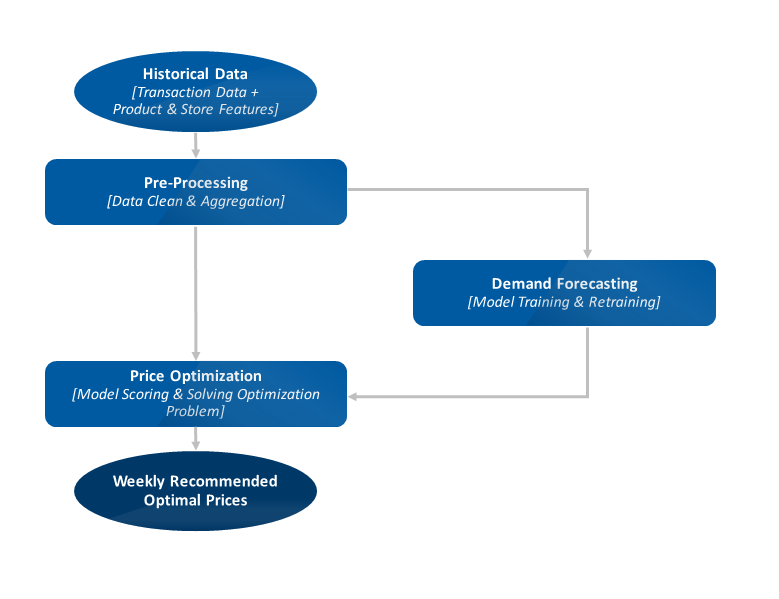

# Pricing

## Typical stpes

1. Data collection: transactional data, product data, customer data
2. Exploratory data analysis: understand the data, identify patterns, and relationships
3. Preprocessing: data cleaning, feature engineering
4. Forecasting: predict demand
5. Optimization: price optimization
   - Given the demand forecast, the goal is to find the optimal price that maximizes the profit
6. Recommendation: recommend prices to the business
7. Evaluation: A/B testing / Causal Impact Analysis

## Recommended Readings

- [online retail analytics notes](/online_retail_analytics.md)
