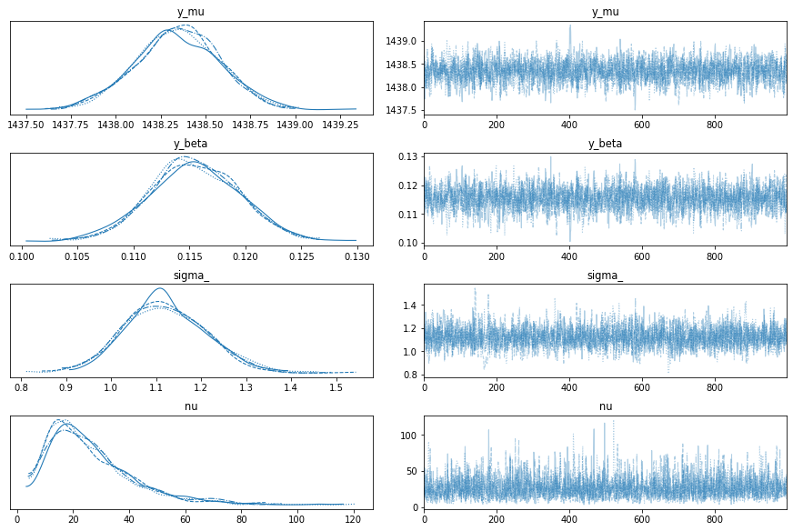
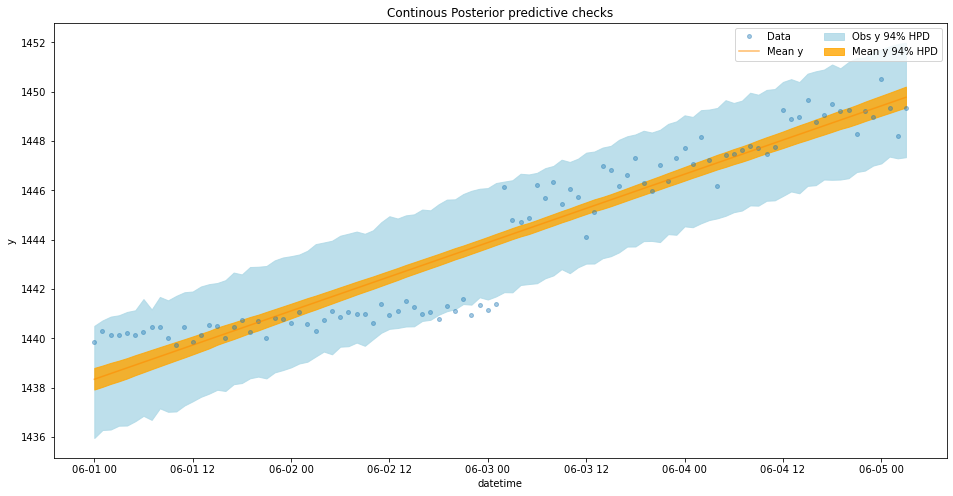
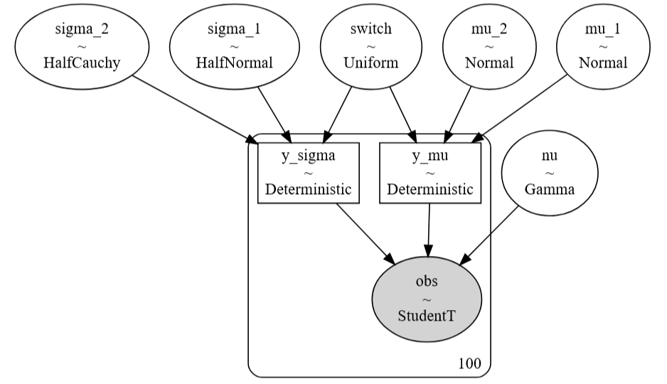
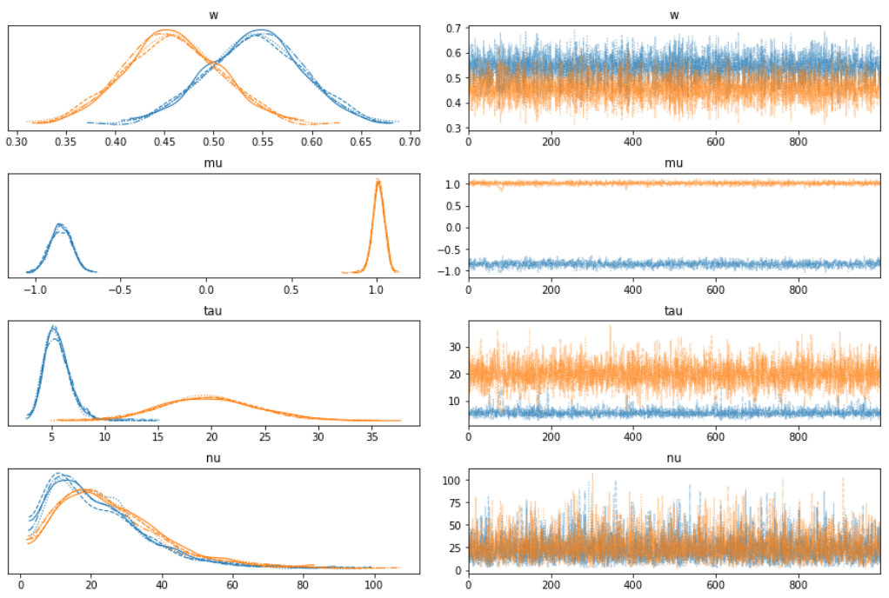
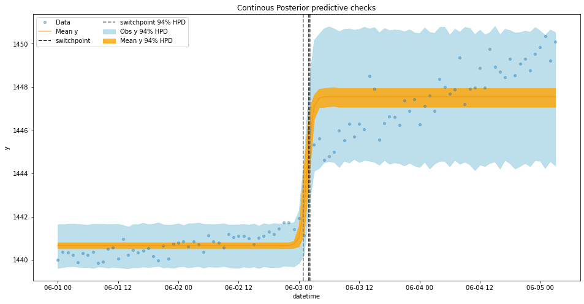
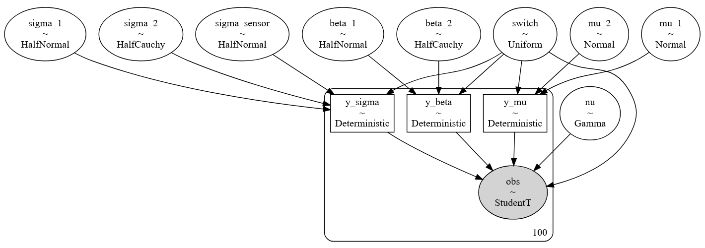
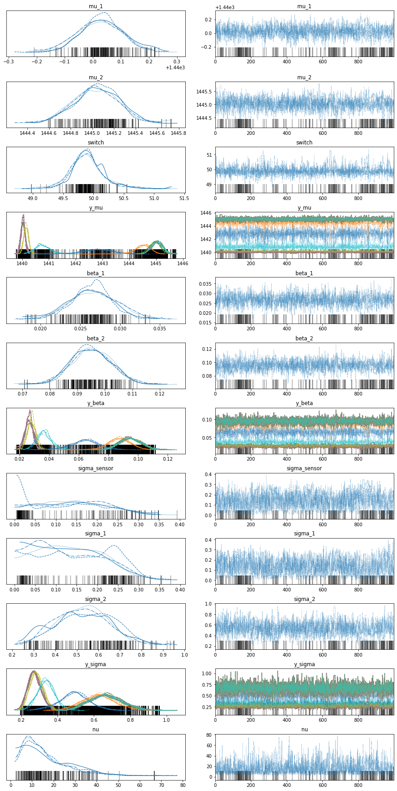
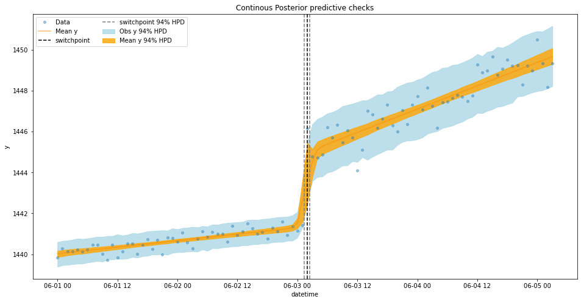

- Implemented several hierarchical Bayesian model to detect changepoints in time series data

## Baseline Model

A simple linear regression model is used to fit the data.

Trace plot is shown below:

Fitted as:

## First model

Model architecture:

Trace plot is shown below:

Fitted as:

## Second model

Model architecture:

Trace plot is shown below:

Fitted as:

## Comparison

| model | rank | weight | loo | d_loo |
| --- | --- | --- | --- | --- |
| switchpoint | 0 | 0.971818 | -72.991731 | 0.000000 |
| baseline | 1 | 0.028182 | -158.430899 | 85.439168 |

Rank is the rank-order of the models with 0 being the best model. Weight can be loosely interpreted as the probability of each model (among the compared model) given the data. As a result, the switchpoint model is much better than the baseline model.
