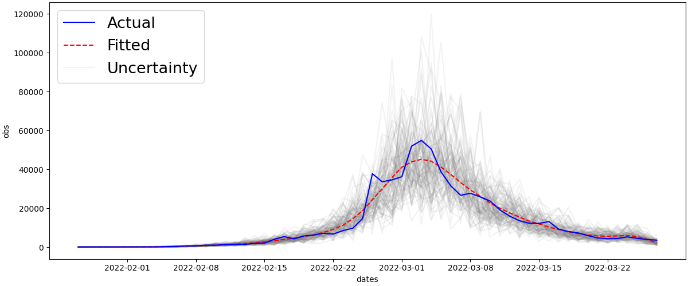
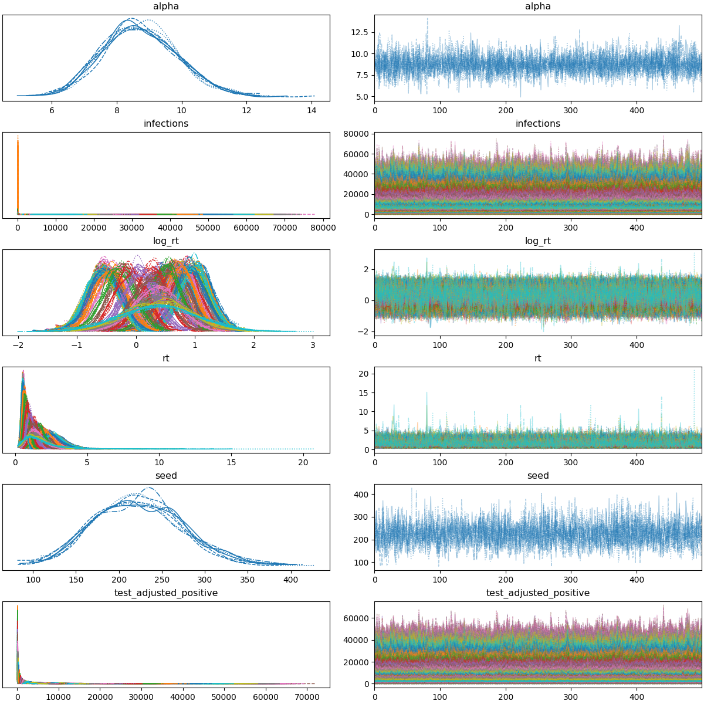

This project uses Bayesian methods and probabilistic programming to analyze the COVID-19 pandemic. It estimates effective reproduction rate and daily new cases for Hong Kong. The data is obtained from [DATA.GOV.HK](https://data.gov.hk/en-data/dataset/hk-dh-chpsebcddr-novel-infectious-agent).

The main idea is based on rtlive and k-sys/covid-19 by Thomas Wiecki and Kevin Systrom. The model is a State Space Model with Gaussian random walk prior, implemented in PyMC.

A few plots are generated to visualize the results.

Daily new cases

Trace plot

