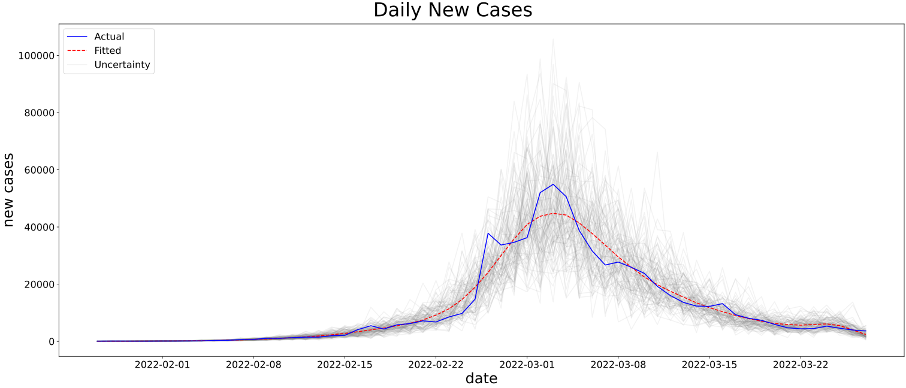

This project uses Bayesian methods and probabilistic programming to analyze the COVID-19 pandemic. It estimates effective reproduction rate and daily new cases for Hong Kong. The data is obtained from [DATA.GOV.HK](https://data.gov.hk/en-data/dataset/hk-dh-chpsebcddr-novel-infectious-agent).

The main idea is based on rtlive and k-sys/covid-19 by Thomas Wiecki and Kevin Systrom. The model is a State Space Model with Gaussian random walk prior, implemented in PyMC.

A few plots are generated to visualize the results. Note that time series plots are mostly in aspect ratio 21:9 for better visualization.[[1]](http://vis.stanford.edu/files/2006-Banking-InfoVis.pdf)[[2]](http://vis.stanford.edu/files/2012-SlopeComparison-InfoVis.pdf)

